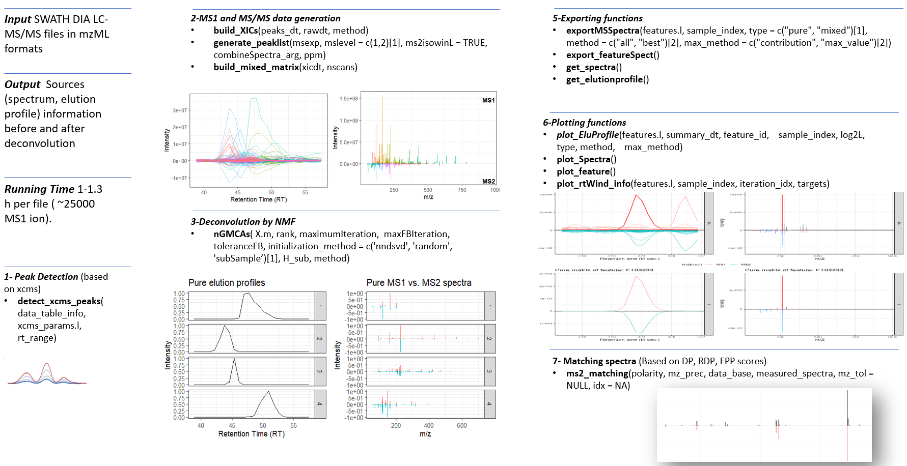

```{r, include = FALSE}
knitr::opts_chunk$set(
  collapse = TRUE,
  comment = "#>",
  warning = FALSE,
  message = FALSE
)
```

```{r setup}
library(DIANMF)
```


**DIANMF** 


# Introduction {#intro}


Liquid chromatography coupled to High Resolution Mass spectrometry (LC-HRMS) is a leading analytical strategy for discovering metabolomics biomarkers in health and disease. In particular, tandem mass spectrometry (LC-HRMS/MS) enables the structural characterization of metabolites by acquiring fragmentation spectra (MS2). Among recent advances, **D**ata **I**ndependent **A**cquisition (DIA), and especially **S**equential **W**indow **A**cquisition of all **TH**eoretical Mass spectrometry (SWATH)-type [@wang2019advancing], offer high-throughput and comprehensive MS/MS data scans of all precursor ions. However, SWATH-DIA spectra are complex and hybrid, as they contain mixed fragments from multiple co-eluting and co-isolated compounds, complicating compound identification. There remains a critical need for tools capable of unmixing such complex signals in a fully untargeted manner.

we recently took advantage of the blind source separation (BSS) paradigm and developed for the first time a non-negative matrix factorization (NMF) approach to unmix the MS2 spectra [@10715181], **without relying on predefined peak models or spectral libraries**. This method demonstrated strong performance on spiked compounds in SWATH-DIA datasets, especially in resolving low-intensity and co-eluting signals. By jointly analyzing all SWATH windows, we enhanced the quality of the resulting pure MS2 spectra by capturing comprehensive fragment information associated with each precursor ion species, including adducts, isotopes, and dimers.

Building on this, we extend the use of NMF and developed **DIA-NMF**, a novel complete computational workflow based on sparse NMF, designed to unmix MS1 and SWATH-DIA MS2 spectra. It is a novelty compared to existing DIA methods. The algorithm detects MS1 peaks, extracts mixed MS1 and MS2 signals within minimally overlapping retention time windows, aligns them, and jointly unimixes these by **NMF** to recover pure precursor and fragment patterns (MS1 and MS2 spectra, respectively).

This generalization improves analytical rigour —since MS1 ions from the same molecule share elution profiles and are indistinguishable by DIA alone— and increases efficiency by yielding MS1 spectra alongside MS2 spectra. Our approach fully leverages the strengths of NMF by unmixing all compounds within a retention time window simultaneously, significantly reducing spectral redundancy and enabling complete MS1/MS2 data processing in under an hour. Soon we will publish the related journal paper.

The **DIA-NMF** workflow is provided through **DIANMF**, a fast and open-source R package. This vignette demonstrates how to process SWATH-DIA datasets using DIANMF. The packages provide MS1 peak detection from input files in mzML or mzXML format. These results are then passed to the DIA-NMF wrapper function, consisting of five steps. Finally, the vignette illustrates how to interact with and analyze the resulting deconvoluted results. 


# Dataset description and loading

For demonstration purposes and to speed up the processing of this document, we will analyze a tiny subset of real spiked data from [@BarbierSaintHilaire_ComparativeEvaluationData_2020]. This dataset correspond to Human plasma samples with a pool of 47 known chemical compounds added at 7 known concentrations (from 0 to 10 ng/ML). Each sample was acquired in triplicate by LC-(ESI+)MS/MS using a SWATH-DIA method on an Orbitrap Fusion instrument. Each full scan MS event was followed by ten MS2 spectra collected from consecutive isolation windows (20 to 50 Da each). A stepped fragmentation method was used at 30 $\pm$ 20 Normalized Collision Energy (NCE). MS1 and MS2 spectra were recorded at a resolution of 120,000 and 15,000 (at $m/z$ 200), respectively.

The data-test mzML files are provided in our package. They are subsets from replicate 1 and 2 of the 10 ng/ML concentration file from 280-320 $m/z$, and 280-320 seconds. This data-test consists of the "(-)-Scopolamine" (a spiked compound) of mass-to-charge ratio ($m/z$) 304.1543 and retention time ($rt$) 300 seconds.

Let us load our package and the data-test mzML files.

```{r load mzML file, echo=TRUE }

# load  the package
library(DIANMF)
library(BiocParallel)
library(Spectra)

# load the data-test
input_dir <- system.file("extdata", package = "DIANMF")
input_dir

file1 <- system.file("extdata", "test_data_20170805_FS-DIA-E2-10ng-rep1_pos_49.mzml", package = "DIANMF")
file2 <- system.file("extdata", "test_data_20170805_FS-DIA-E2-10ng-rep2_pos_50.mzml", package = "DIANMF")
```


## MS1 Peak Detection 

The MS1 peak detection is based on XCMS [@xcms]. Below, we show DIANMF functions to help users unfamiliar with XCMS detect and align MS1 peaks:

1. `prepare_mzMLfiles()`
   - Input: mzML/mzXML files directory path.
   - Task: Load and prepare files. \
2. `create_seq()`
   - Input: `data.table` from `DIANMF::prepare_mzMLfiles()`.
   - Task: Create a simple sequence from a list of mzML/mzXML paths. \
3. `detect_xcms_peaks()`
   - Detect MS1 peaks, taking as inputs `data.table` from `DIANMF::create_seq()` and a list of XCMS parameters. \

```{r detect peaks by xcms, echo=TRUE }

mzml_dt <- prepare_mzMLfiles(input_dir)
mzml_seq <- create_seq(mzml_dt)

params_ls <- list(
    "CentWaveParam" = xcms::CentWaveParam(
      ppm = 5,
      peakwidth = c(3, 15),
      snthresh = 2,
      prefilter = c(5, 4000),
      mzCenterFun = "wMeanApex3",
      integrate = 2,
      mzdiff = -0.005,
      noise = 100,
      firstBaselineCheck = FALSE
    ),
    "MergeNeighboringPeaksParam" = xcms::MergeNeighboringPeaksParam(
      expandRt = 2,
      expandMz = 0.001,
      ppm = 2,
      minProp = 0.75
    ),
    "ObiwarpParam" = xcms::ObiwarpParam(
      binSize = 0.05
    ),
    "PeakDensityParam" = xcms::PeakDensityParam(
      sampleGroups = NA,
      bw = 10,
      minFraction = 0.1,
      minSamples = 2,
      binSize = 0.01,
      ppm = 7,
      maxFeatures = 500
    ),
    "ChromPeakAreaParam" = xcms::ChromPeakAreaParam()
  )

xcms_obj <- detect_xcms_peaks(sequence_table = mzml_seq, params = params_ls)
xcms_obj

```

`xcms_obj` is a `r class(xcms_obj)` container for xcms preprocessing results,i.e. results from chromatographic peak detection, alignment and correspondence analysis. Features and their associated detected MS1 peaks can be accessed by **DIANMF** functions: `extract_xcms_peaks()` and `extract_xcms_features()` respectively. 

```{r extract MS1 peaks and features, echo=TRUE }

# MS1 peaks
ms1_xcms_peaks <- extract_xcms_peaks(msexp = xcms_obj)
knitr::kable(head(ms1_xcms_peaks[, c(1:12)]), row.names = FALSE)

# MS1 features
ms1_xcms_features <- extract_xcms_features(msexp = xcms_obj, quantifyL = TRUE)
knitr::kable(head(ms1_xcms_features), row.names = FALSE)
```


## Wrapper DIA-NMF Workflow Function


`xcms_obj` is given to the wrapper function `DIANMF::DIANMF.f()` along with several configurable parameters to conduct the analysis. We briefly explain the main parameters here to facilitate the practical use of **DIANMF** across a range of datasets. `DIANMF::DIANMF.f()` can process a specific sample given by its injection index in `sample_idx` or all samples iteratively when this parameter is `NULL`.

Below, we summarize the most relevant parameter categories and their roles in the DIA-NMF workflow.

1. MS1–MS2 Joint Deconvolution
  - `MS1MS2_L`: `Logical` parameter determines whether MS1 and MS2 data are deconvolved jointly or semi-independently. When enabled, both MS1 and MS2 matrices are factorized simultaneously, leveraging the fact that precursor ions and their corresponding fragments typically share the same elution profile \


2. Signal Quality and Filtering
  - `min_contrib`: `numeric(1)` between 0 and 1. Specifies the minimum contribution of ions that a pure MS1 spectrum must have to be kept. Sources failing to meet this threshold are considered low-confidence or noisy and are discarded. 
  - `nscans`: `numeric(1)` filters out EICs from the mixed matrices that do not exhibit a minimum number of consecutive non-zero intensity scans, thereby removing unreliable signal traces. \
  - `clean_sources`: `Logical` `TRUE` to clean/remove sources with less than the contribution threshold in `min_contrib` for any peaks, else to keep all sources.\


3. Retention Time Window Selection 
  - `rt_method`: `character` `constant` or  `peak`. This parameter defines the strategy for retention time segmentation. A fixed-window approach (i.e. `constant`) offers simplicity and uniformity, whereas a peak-based method (i.e. `peak`) adjusts the window size dynamically to fit the observed peak shape, capturing complete elution profiles even for broader or asymmetrical peaks.  
  - `scan_rt_ext`: `numeric(1)` parameter (when applicable) defines the margin by which retention time windows are expanded.  \
  
  
4. Spectral Extraction 
  - `combineSpectra_arg`: `list` that governs how data extracted from the raw data are merged into individual representative spectra. Levels include controlling the m/z tolerance (`ppm`), the method of combining peak sets (`union` or `intersect`), intensity aggregation, etc. \


5. NMF Deconvolution Settings
  - `rank`: `numeric(1)` rank of factorization, defines the number of latent components (i.e., sources) to extract. Higher values allow greater resolution of co-eluting signals with a slight increase in computational cost. Low ranks give unreliable sources.
  -  `maxFBIteration` and `maximumIteration`: `numeric(1)` specify the iteration number of sub-problems and the complete algorithm. High values are required to guarantee the convergence to a global optimal solution.
  - `toleranceFB` `numeric(1)` sets the threshold for convergence, balancing precision and speed.
  - `initialization_method`: `character` controls how to initialize the matrices; we recommend using Nonnegative Double Singular Value  Decomposition (`nndsvd`) to provide informative initial conditions.
  - `method` parameter specifies the numerical solver used for singular value computation. \


```{r wrapper function, echo=TRUE }

BiocParallel::register(SnowParam(workers = 1))

features <- DIANMF.f(
    msexp = xcms_obj,
    sample_idx = NULL,
    MS1MS2_L = TRUE,
    rank = 30,
    min_contrib = 0.6,
    maximumIteration = 200,
    maxFBIteration = 100,
    toleranceFB = 1e-05,
    initialization_method = "nndsvd",
    errors_print = FALSE,
    method = "svds",
    sparsityA = TRUE,
    scan_rt_ext = 10,
    min_distance = 4,
    featuresn = NULL,
    nscans = 3,
    rt_method = "constant",
    clean_sources = TRUE,
    combineSpectra_arg = list(
      peaks = "union",
      ppm = 5,
      tolerance = 0.005
    ),
    verbose = T,
    BPPARAM = bpparam()
  )
```

The `DIANMF.f()` standard output is a `list` object. Each level is related to a sample (file), where the user can find information about all existing metabolites from the biological sample, before and after deconvolution. In order to provide a better view of the results, we implemented plenty of functions in the **DIANMF** package that aim to export, plot and match pure or mixed data.

## Interactive Output and Functionalities of the DIA-NMF Package


`get_feature_summary()` returns a `data.table` of features with their optimal sources, based on the `max_method` parameter (`string`):

  - `contribution`: select the source with maximum contribution of this feature. \
  - `max_value`: select the source with maximum feature apex pure value (intensity). \

Columns **iteration** and **source** give the information where each feature in **featureid** was extracted (in which rt window: iteration) and to which source it was assigned, respectively.    

```{r summary data.table, echo=TRUE}

summary.dt <- get_feature_summary(features.l = features, max_method = "max_value")
knitr::kable(head(summary.dt), row.names = FALSE)

```

From now on, we will focus on the spiked compound "(-)-Scopolamine" of $m/z$ 304.1543 and $rt$ 300 seconds. Using 10 ppm and 10 seconds for the $m/z$ and $rt$ tolerances, feature **FT07** is related to "(-)-Scopolamine". So let us export all related data and plots.  

Exporting and plotting functions share many common parameters. For ease, we will introduce them here:

- `features.l`: `list` output of `DIANMF::DIANMF.f()`
- `summary_dt`: `data.table` output of `DIANMF::get_feature_summary()`. If `NULL`, it will be extracted. 
- `feature_id`: `character` targeted feature id. 
- `sample_index`: `numeric(1)` sample index.
- `max_method = c(max_value, max_contribution)[1]`: to extract the feature info based on maximum intensity or contribution.   
- `type = c("pure", "mixed")[1]`: to extract pure (after deconvolution) or mixed (raw) data.
- `method = c("all", "best")[2]`: to extract all suggestions or the best one.

### Exporting Functions


`get_elutionprofile()` and `get_spectra()` are functions to extract the elution profiles and spectra respectively.

```{r Exporting functions, echo=TRUE}

scopolamine_id <- "FT15"

feature_elution_profile <- get_elutionprofile(
    features.l = features,
    summary_dt = summary.dt,
    feature_id = scopolamine_id,
    sample_index = 1,
    type = c("pure", "mixed")[1],
    method = c("all", "best")[2],
    max_method = "max_value"
  )

knitr::kable(head(feature_elution_profile), row.names = FALSE)

feature_spectra <- get_spectra(
    features.l = features,
    summary_dt = summary.dt,
    feature_id = scopolamine_id,
    sample_index = 1,
    type = c("pure", "mixed")[1],
    method = c("all", "best")[2],
    max_method = "max_value"
  )
```

`feature_spectra` contains MS1 and MS2 spectra. The MS2 spectrum contains all related fragments of the processed precursor from all isolation windows.

```{r specific spectra, echo=TRUE}

# MS1 spectrum 
ms1_spectrum <- feature_spectra[ mslevel == "MS1", ]
head(ms1_spectrum)

# MS2 spectrum
ms2_spectrum <- feature_spectra[ mslevel == "MS2", ]
unique(ms2_spectrum$IsoWin)
head(ms2_spectrum)
```


It can be helpful to extract `Spectra` objects, which encapsulate spectral mass spectrometry (MS) data and associated metadata. This class provides accessors, filtering, and analysis methods for MS data, while delegating actual data storage and retrieval to a backend. This design enables flexible data representation, allowing users to adapt `Spectra` objects to different needs and data characteristics. To support this, **DIANMF** offers functions for extracting such objects for individual features —whether pure or mixed MS1 and MS2 spectra— and other choices based on the parameters used. Alternatively, users can extract `Spectra` objects representing all processed signals from a raw file. These tasks can be performed using the `export_featureSpect()` and `exportMSSpectra()` functions.


```{r Exporting Spectra objects, echo=TRUE}

# (-)-scopolamine pure MS1 and MS2 spectra
scopolamine_spect <- export_featureSpect(features.l = features,
                                        feature_id = summary.dt$featureid[1],
                                        sample_index = 1,
                                        type = c("pure", "mixed")[1],
                                        method = c("all", "best")[1],
                                        max_method = c("contribution", "max_value")[2] )
scopolamine_spect

# all signals MS1 and MS2 spectra processed in a sample
msSpectra <- exportMSSpectra(features.l = features,
                               sample_index = 1,
                               type = c("pure", "mixed")[1],
                               method = c("all", "best")[2],
                               max_method = c("contribution", "max_value")[2] )

msSpectra

Spectra::spectraVariables(msSpectra)

filtered_spect <- msSpectra[spectraData(msSpectra)$name == scopolamine_id]
ms2_spect <- Spectra::filterMsLevel(filtered_spect, 2L)
ms2_spect
```


### Plotting Functions

Several plotting functions were added to our package to let the user interact and visualize the results, such as `plot_EluProfile()`, `plot_Spectra` and `plot_feature()`. Moreover, `plot_rtWind_info()` function gives you a summary of retention time window deconvolution, i.e. specific iteration. It plots the mixed extracted raw MS1 and MS2 chromatograms and spectra, the pure elution profiles of all extracted sources (pure compounds), besides their pure MS1 (in the positive mode) and MS2 spectra (in the negative mode). The **DIANMF** recovered pure MS2 spectra **integrate fragment ions originating from all relevant SWATH isolation windows**, providing an enriched and structurally informative view of each compound, which helps the MS/MS compound identification. For this, distinct colours are used for the different isolation windows in some MS2 spectra plots.


```{r Plotting functions, echo=TRUE}

# pure elution profiles plot
chrom <- plot_EluProfile(
    features.l = features,
    summary_dt = summary.dt,
    feature_id = scopolamine_id,
    sample_index = 1,
    log2L = FALSE,
    type = c("pure", "mixed")[1],
    method = c("all", "best")[1],
    max_method
  )
chrom

# pure MS1 vs. MS2 spectra plot
spect1_p <- plot_Spectra(
    features.l = features,
    summary_dt = NULL,
    feature_id = scopolamine_id,
    sample_index = 1,
    log2L = F,
    type = c("pure", "mixed")[1],
    method = c("all", "best")[2],
    max_method
  )
spect1_p

# mixed and pure feature plot
feat_p <- plot_feature(
    features.l = features,
    summary_dt = summary.dt,
    feature_id = scopolamine_id,
    sample_index = 1,
    log2L = FALSE,
    max_method = "max_value",
    method = c("all", "best")[2]
  )
feat_p

# retention time window plot
rt_wind <- plot_rtWind_info(features.l = features, sample_index = 1, iteration_idx = 1, targets = NULL)
rt_wind_p <- rt_wind$p_final
rt_wind_p

```


### Spectral matching

Identification is the major challenge in SWATH-DIA metabolomics. The MS1 and MS2 pure spectra can be matched against database libraries using the three classical scores:

-   The dot product (DP): $\sum (I_{measured} \times I_{library})^2 / (\sum I^2_{measured} \times \sum I^2_{library})$.
-   The reverse dot product (RDP): is the same as the dot product but restricted to the fragments common to the query and reference spectra.
-   The fragments percentage ratio (FPP): is the ratio of reference peaks found in the query spectrum: (matched fragments) / (reference fragments).

These scores can be calculated using these **DIANMF** functions, where spectral **alignment** is done too:

-   [GetSimpleDotProductSimilarity()]{style="background-color: rgba(169, 169, 169, 0.4);"}.
-   [GetPresenceSimilarity()]{style="background-color: rgba(169, 169, 169, 0.4);"}.
-   [getReverseSearchingSimilarity()]{style="background-color: rgba(169, 169, 169, 0.4);"}.


Or, directly by the main function [match_pure_scores2()]{style="background-color: rgba(169, 169, 169, 0.4);"}. The main function parameters are:

-   [polarity]{style="background-color: rgba(169, 169, 169, 0.4);"} *POS* or *NEG*.
-   [mz_prec]{style="background-color: rgba(169, 169, 169, 0.4);"} precursor mz value.
-   [data_base]{style="background-color: rgba(169, 169, 169, 0.4);"} library database.
-   [measured_spectra]{style="background-color: rgba(169, 169, 169, 0.4);"} experimental pure spectrum.
-   [mz_tol]{style="background-color: rgba(169, 169, 169, 0.4);"}: mz tolerance to bin the ions.


# Appendix

## NMF algorithm nGMCA$^s$ {#mainproblem}

Given a mixed matrix $X\in \mathbf{R} ^{m \times n}$, the components' sources are mixed up in an unknown but linear way. The un-mixing model can be compactly written in this matrix form:

```{=tex}
\begin{equation}
\label{eq1}
X_{m,n} \approx W_{m,r} H_{r,n} \;\ \text{(1)}
\end{equation}
```
where $W \in \mathbf{R}^{m \times r}$ is the basis matrix and $H \in \mathbf{R}^{r \times n}$ is the coefficients matrix. Each column of $W$ is the unknown spectrum/source that is not negative, whereas each row of $H$ represents an elution profile that determines the contribution of each source, which is also non-negative. Thus, $n$ is the number of measurements, $m$ is the number of source samples, and $r$ is the number of pure sources exist in $X_{m,n}$.

The rank of factorization ($r$) remains a challenge in NMF problems. However, it is robust in our case, meaning ranking over estimations is worse than assigning a fixed tiny rank. Until now, we have set it to three, so we are confident that one pure component is related to the precursor we are attempting to identify, one to another precursor, and the third may collect all noise in the matrix.

Solving problem [(1)](#mainproblem) can be written under the constrained form:

\begin{align} \label{eq2} 
\underset{\substack{W, H \geqslant 0}}{\text{argmin}} \, \mathcal{D}(X \parallel WH) + J(W). 
\end{align} $\mathcal{D}$ is a divergence function, as the Euclidean distance $(l_2)$, it measures the discrepancy between the data $X$ and it's factorization $WH$. $J$ is an optional regularization function providing prior information about the spectra.

Rapin et al. introduced the nGMCA$^s$ [@Rapin_2016_ApplicationNonnegativeMatrix], [@Rapin_2013_SparseNonNegativeBSS] algorithm, which aims to solve the sparse non-negative blind source separation. This algorithm minimizes the following optimization problem: \begin{align} \label{sp_W}
    \underset{\substack{W, H}}{\text{argmin}} \, \frac{1}{2}||X - WH||^2_2 + \lambda ||W||_1 + i^{+}(W) +  i^{+}(H),
\end{align} where $i^{+}$ is the characteristic function of the non-negative orthant that enforces the non-negative constraints; it is applied point-wise on every entry of $W$ and $H$: \vspace{-0.1cm} \begin{align}
i^{+}(w_{i,j}) =
\begin{cases}
0 & \text{if} \quad w_{i,j} \geq 0. \\
+ \infty  & \text{otherwise.}
\end{cases}
\end{align}

nGMCA$^s$ alternatively minimizes the constrained sub-problems to obtain stable solutions with the sought structure:

1.  Fix H, sub-problem in W is: \begin{align}
    \underset{\substack{W}}{\text{argmin}} \, \frac{1}{2}||X - WH||^2_2 + \lambda ||W||_1 + i^{+}(W).
    \end{align}
2.  Fix W, sub-problem in H is: \begin{align}
    \underset{\substack{H}}{\text{argmin}} \, \frac{1}{2}||X - WH||^2_2 + i^{+}(H).
    \end{align}

These sub-problems can be solved by the forward-backward splitting algorithm (FBS) [@Combettes_2005_SignalRecoveryProximal] from proximal splitting methods.


# Cheat sheet

```{r cheat-sheet, echo=FALSE, out.width="100%"}

```

# Session info

Here is the output of `sessionInfo()` on the system on which this document was compiled:

```{r sessionInfo, echo=FALSE}
sessionInfo()
```

# References