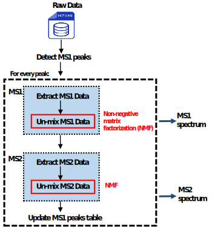
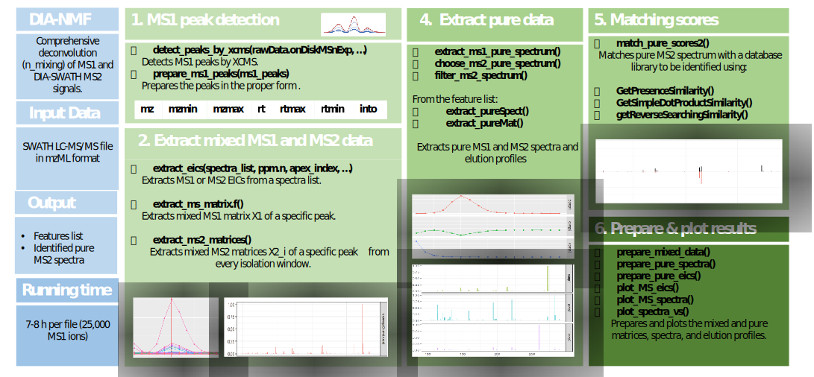

```{r, include = FALSE}
knitr::opts_chunk$set(
  collapse = TRUE,
  comment = "#>",
  warning = FALSE,
  message = FALSE
)
```

**DIANMF** provides a comprehensive pipeline to extract pure MS1 and MS2 spectra from LC-MS using **N**on-Negative **M**atrix **F**actorization (NMF). It supports LC-MS and LC-MS/MS acquisitions in `.mzML` format and outputs a list of unique pure spectra for each file. The procedure includes the following steps:

1.  Chromatographic peak detection at the MS1 level.\
2.  For every MS1 peak $p$, construct the related MS1 matrix $X^1$ (every row of this matrix is an extracted ion chromatogram (EIC) of MS1 fragment/ion that may relate to the precursor $p$).\
3.  Factorize $X^1$ to extract the pure MS1 information related to $p$: pure MS1 spectrum $s1_p$ and its elution profile.\
4.  Extract the MS2 matrices from every isolation window $X^2_i$, using the information in $s1_p$.\
5.  Factorize the concatenation of these MS2 matrices $X^2$ using NMF to get the MS2 pure spectra $s2_p$.\
6.  Finally, match $s2_p$ to a library database to identify the precursor (metabolite).

This vignette showcases the processing steps to extract pure spectra from a small SWATH DIA LC-MS/MS dataset with **DIANMF** and can be used in 2 different ways:

1.  by using a wrapper function to run the full workflow from `.mzML` files [see Use-Case 1](#caseA)
2.  by using separate functions to run individual steps [see Use-Case 2](#caseB)

A more detailed description of the implemented methods can be found in the [Introduction](#intro)



# Introduction {#intro}

One of the main challenge in untargeted metabolomics is molecule identification and annotation. Fragmentation methods are widely used in **M**ass **S**pectrometry (MS) based approaches to gather specific information on unknown molecules. Different fragmentation methods exists, each one having a trade-off between specificity and coverage. A promising with wide coverage is the **S**equential **W**indow **A**cquisition of all **T**heoretical **D**ata-**I**ndependent **A**cquisition (SWATH-DIA) methods. However, the acquired MS2 spectra are hybrid mixtures, posing significant annotation challenges. We developed the **DIANMF** R package to adress to overcome this challenges and propose a robust and efficient way to unmix the spectra for untargeted metabolomics applications.

Non-negative matrix factorization is widely used for analyzing high-dimensional data and feature extraction [@Fu_2019_NonnegativeMatrixFactorization]. It automatically extracts meaningful features from a set of non-negative linear mixtures. This non-negativity arises naturally in many real problems such as hyperspectral sensors [@Brezini_2020_NMFBasedMethodHyperspectral], audio processing [@Fevotte_2009_NonnegativeMatrixFactorization], clustering [@Kim_2008_SparseNonnegativeMatrix], and spectrometry [@Dubroca_2012_WeightedNMFHighresolution]. It has been recently applied to LC-MS [@Rapin_2016_ApplicationNonnegativeMatrix]and has been shown superior to model peak algorithms for gas chromatography (GC)-MS data [@Smirnov_2019_ADAPGCApplicationClusteringAssisted]. Furthermore, on the assumption that for every metabolite, the existing information in the MS1 data correlates in the same sample with its MS2 data. Exploits this quantitative information to deconvolute complex SWATH DIA spectra.

The two existing approaches that address the issue of DIA data without relying on predefined spectral libraries for un-mixing are MS-DIAL [@Tsugawa_2015_MSDIALDataindependentMS] and DecoMetDIA [@Yin_DecometdiaDeconvolutionMultiplexed_2019]. These workflows are based on determining peak models for each precursor: the mixed elution profiles are decomposed as linear combinations of these peaks. Such a strategy, however, is not appropriate for small peaks whose retention time is close to more intense ones (co-eluting compounds). In such cases, the peak shape defined by the algorithm may encompass several analytical peaks and may not allow their proper deconvolution [@Smirnov_2019_ADAPGCApplicationClusteringAssisted].

NMF is not the only advantage of **DIANMF**. However, the methodology used to extract the mixed data and use the pure MS1 information for every peak to collect its MS2 data are essential aspects of our workflow. Every ion in the pure MS1 spectrum, depending on its $m/z$ value, was fragmented in a specific isolation window. This fact leads us to: from every window, we extract all MS2 fragments generated from the fragmented MS1 ions.

# Dataset description and loading

For demonstration purposes and to speed up the processing of this document, we will analyze a tiny subset of real spiked data from [@BarbierSaintHilaire_ComparativeEvaluationData_2020]. This dataset correspond to Human plasma samples with a pool of 47 chemical compounds added at 7 known concentrations (from 0 to 10 ng/ml). Each sample was acquired in triplicate by LC-(ESI+)MS/MS using a SWATH-DIA method on an Orbitrap Fusion instrument. Each full scan MS event was followed by ten MS2 spectra collected from consecutive isolation windows (20 to 50 Da each). A stepped fragmentation method was used at 30 $\pm$ 20 Normalized Collision Energy (NCE). MS1 and MS2 spectra were recorded at a resolution of 120,000 and 15,000 (at $m/Z$ 200), respectively.

The data test mzML file is provided in our package. It is a subset from replicate 3 of the 10 ng/ml concentration file from 100-290 $m/Z$, 425-440 seconds, and precursorMZ $<=$ 280 at the MS2 level. The data set consists of the "Dextromethorphan" spiked compound of $m/Z$ 272.2009 and $rt$ 432 seconds.

Let us load our package and the dataset mzML file.

```{r load mzML file, echo=TRUE }
# load  the package
library(DIANMF)
# load the dataset
file <- system.file("extdata", "test_data.mzml", package = "DIANMF")
```

# Use-Case 1: One-step workflow {#caseA}

## Process all metabolites with wrapper function

The [dia_nmf.f()]{style="background-color: rgba(169, 169, 169, 0.4);"} function is a wrapper for the **DIANMF** methods for processing all metabolites from mzML file. Start by detecting MS1 peaks and end by giving pure MS2 spectrum for every metabolite.

```{r main function MS2 level, echo=TRUE }
MS2_features <- dia_nmf.f( mzML_path = file,
                       ms_level = "MS2",
                       peaks_by_xcms = TRUE, ms1_peaks = NULL,
                       ppm = 6, peakwidth = c(3,60), snthresh = 0,
                       prefilter = c(5,4000), mzCenterFun = "wMeanApex3",
                       integrate = 2, mzdiff = -0.001, noise = 0,
                       firstBaselineCheck = FALSE )
```

The first main step, detecting MS1 peaks, is performed by [xcms](https://bioconductor.org/packages/release/bioc/html/xcms.html) software. It is also possible to provide the MS1 peaks as a matrix or data frame in [ms1_peaks]{style="background-color: rgba(169, 169, 169, 0.4);"} with [peaks_by_xcms = FALSE]{style="background-color: rgba(169, 169, 169, 0.4);"}.

[dia_nmf.f()]{style="background-color: rgba(169, 169, 169, 0.4);"} parameters:

1.  [mzML_path]{style="background-color: rgba(169, 169, 169, 0.4);"} mzML file path.
2.  [ms_level]{style="background-color: rgba(169, 169, 169, 0.4);"} character 'MS1' or 'MS2' level.
3.  [peaks_by_xcms]{style="background-color: rgba(169, 169, 169, 0.4);"} Logical TRUE if the user wants to detect MS1 levels using XCMS, FALSE if the user will provide the peaks matrix or data frame to be identified.
4.  [ms1_peaks]{style="background-color: rgba(169, 169, 169, 0.4);"} matrix or data.frame contains MS1 peaks to be identified. It should contain these columns: mz, mzmin, mzmax, rt, rtmin, rtmax, into.
5.  Some [xcms::findChromPeaks()]{style="background-color: rgba(169, 169, 169, 0.4);"} parameters: ppm, peakwidth, snthresh, prefilter, mzCenterFun, integrate, mzdiff, ...

## Export results

MS2_features is an R object consisting of all peaks processing information in the two levels, MS1 and MS2. Such as the MS1 peaks, $W_{ms1}$, $H_{ms1}$, $W_{ms2}$, $H_{ms2}$, the MS1 pure spectrum, the MS2 pure spectrum, and the specific one (all these objects will be introduced in the coming section).

The pure MS2 spectra are the most interesting and needed by the user; these information can be exported using [extract_pureSpect(features, spec_level)]{style="background-color: rgba(169, 169, 169, 0.4);"}. Where [spec_level]{style="background-color: rgba(169, 169, 169, 0.4);"} determine the type of the pure spectrum:

1.  *MS1 spectrum*
2.  *MS2 spectrum* contains all precursor fragments, including the precursor adducts, losses, and isotope fragments.
3.  *Specific MS2 spectrum* is the MS2 spectrum related to the precursor and its fragments without its adducts and loss fragments.

```{r extract pure spectra, echo=TRUE }
# extract MS1 pure spectra
ms1_spectra <- extract_pureSpect(features = MS2_features, spec_level = "MS1")

# extract MS2 pure spectra
ms2_spectra <- extract_pureSpect(features = MS2_features, spec_level = "MS2")

# extract the precursor's specific MS2 pure spectra
ms2_SpecificSpectra <- extract_pureSpect(features = MS2_features, spec_level = "MS2_specific")
```


# Use-Case 2: Step-by-Step Processing {#caseB}

## Chromatographic peak detection

The first main step in processing raw metabolomic data is to detect the ion peaks at the MS1 level. The MS1 peaks are all signals in the sample produced by ions from the same originating component species. In **DIANMF**, the user has two choices:

1.  Detect them by [xcms](https://bioconductor.org/packages/release/bioc/html/xcms.html) algorithm: using the [DIANMF::detect_peaks_by_xcms()]{style="background-color: rgba(169, 169, 169, 0.4);"} function which is based on the [xcms::findChromPeaks()]{style="background-color: rgba(169, 169, 169, 0.4);"} method or by calling the xcms function directly.

2.  Provide the MS1 peaks as a matrix or data.frame R object, involving these sufficient information for every peak: **mz**, **mzmin**, **mzmax**, **rt**, **rtmin**, **rtmax**, and **into**.

[ detect_peaks_by_xcms()]{style="background-color: rgba(169, 169, 169, 0.4);"} parameters are:

-   [ rawData.onDiskMSnExp]{style="background-color: rgba(169, 169, 169, 0.4);"} mzML file mass-spectrometry data.
-   [ppm]{style="background-color: rgba(169, 169, 169, 0.4);"} numeric(1) defining the maximal tolerated m/z deviation in consecutive scans in parts per million (ppm) for the initial ROI definition.
-   [peakwidth]{style="background-color: rgba(169, 169, 169, 0.4);"} numeric(2) with the expected approximate peak width in chromatographic space. Given as a range (min, max) in seconds.
-   [snthresh]{style="background-color: rgba(169, 169, 169, 0.4);"} numeric(1) defining the signal to noise ratio cutoff.
-   [prefilter]{style="background-color: rgba(169, 169, 169, 0.4);"} numeric(2) c(k, I) specifying the prefilter step for the first analysis step (ROI detection). Mass traces are only retained if they contain at least k peaks with intensity \>= I.

To import the mass-spectrometry raw data from the mzML file, we will use the [readMSData()]{style="background-color: rgba(169, 169, 169, 0.4);"} function from [ MSnbase]{style="background-color: rgba(169, 169, 169, 0.4);"} package. Just by specifying the mzML file path in [files]{style="background-color: rgba(169, 169, 169, 0.4);"} and [ mode = "onDisk"]{style="background-color: rgba(169, 169, 169, 0.4);"} in order to only generates the object and the raw data is accessed on disk when needed without loading it in the memory.

```{r detect MS1 peaks using xcms, echo=TRUE, message=FALSE, warning=FALSE}
library(MSnbase)

# load the metadata (mass-spectrometry data)
data_test <- MSnbase::readMSData(files = file, mode = "onDisk")
# data_test

# detect MS1 peaks using xcms
ms1_peaks.mat <- detect_peaks_by_xcms( rawData.onDiskMSnExp = data_test,
                                        ppm = 6, peakwidth = c(3,60), snthresh = 0,
                                        prefilter = c(5,4000), mzCenterFun = "wMeanApex3",
                                        integrate = 2, mzdiff = -0.001, noise = 0,
                                        firstBaselineCheck = FALSE )
```

**DIANMF** processes MS1 peaks sequentially, starting with the peak of the highest **into**. [prepare_ms1_peaks()]{style="background-color: rgba(169, 169, 169, 0.4);"} function prepares the peaks in the proper form.

```{r prepare MS1 peak, echo=TRUE, message=FALSE, warning=FALSE}
# prepare the MS1 peaks
ms1_peaks.df <- prepare_ms1_peaks(ms1_peaks = ms1_peaks.mat)

knitr::kable(head(ms1_peaks.df[, c(1:7)]), row.names = FALSE)
```

Each row in this `r class(ms1_peaks.df)` represents the MS1 peak. Every peak is related to a specific precursor, identifying a metabolite in the raw data. Let us proceed with processing a specific MS1 peak, the first one.

```{r choose MS1 peak, echo=TRUE }
# peak index
peak.idx <- 1

# peak mz and rt
mz_prec <- ms1_peaks.df[peak.idx, 'mz']
rt_prec <- ms1_peaks.df[peak.idx, 'rt']
```

<hr style="border: 2px solid black;">

The aim is to identify every peak by finding its pure MS2 spectrum. Such spectrum should include the compound fragments (involving losses and adducts) and isotopes. These fragments have **very close retention times** due to their chemical structure similarities despite **variations in their m/z values**. Thus, they are expected to belong to the same pure MS1 scan. Furthermore, the MS1 data correlates in the same sample with the MS2 data. We exploit this quantitative information to extract the pure MS2 spectrum depending on the information on the pure MS1 data.

<hr style="border: 2px solid black;">

In the following parts, we will describe the different processing steps for every peak:

1.  MS1 data processing:
    -   Extract the peak associated MS1 matrix $X_1$.
    -   Deconvolute $X_1$.
    -   Extract the peak MS1 pure source.
2.  MS2 data processing:
    -   Extract the peak associated MS2 matrices $X_{2_i}$ from the isolation windows.
    -   Deconvolute the mixed MS2 data $X_2$.
    -   Extract the peak MS2 pure source.
3.  MS2 pure spectrum matching

## MS1 data processing

The function [extract_ms_matrix.f()]{style="background-color: rgba(169, 169, 169, 0.4);"} extract the MS1 data associated for this peak. It extracts the extracted ion chromatograms (EICs) for all MS1 fragments in the spectrum at the peak apex spectrum. This function has numerous critical arguments to select depending on the data type the user wants to retrieve (MS1 or MS2). The parameters are:

-   [peak.idx]{style="background-color: rgba(169, 169, 169, 0.4);"} peak index.
-   [ms1_peaks.df]{style="background-color: rgba(169, 169, 169, 0.4);"} MS1 peaks `r class(ms1_peaks.df)`.
-   [rawData.onDiskMSnExp]{style="background-color: rgba(169, 169, 169, 0.4);"} OnDiskMSnExp object for onDisk mode.
-   [ppm.n]{style="background-color: rgba(169, 169, 169, 0.4);"} defining the m/z tolerated deviation in parts per million (ppm).
-   [rt_index]{style="background-color: rgba(169, 169, 169, 0.4);"} if *TRUE* use the real retention time axis of the peak, else *FALSE*.
-   [mz_range]{style="background-color: rgba(169, 169, 169, 0.4);"} *NULL* if no restriction on the mz ranges, else an mz range.
-   [iso_win_index]{style="background-color: rgba(169, 169, 169, 0.4);"} SWATH isolation window index, just for MS2 level. For MS1 data *iso_win_index = NULL*.

For MS1 level, the [rt_index = TRUE]{style="background-color: rgba(169, 169, 169, 0.4);"}, [mz_range = NULL]{style="background-color: rgba(169, 169, 169, 0.4);"} and [iso_win_index = NULL]{style="background-color: rgba(169, 169, 169, 0.4);"} are fixed.

```{r extract the mixed MS1 matrix, echo=TRUE}
X1 <- extract_ms_matrix.f(peak.idx = peak.idx, ms1_peaks.df = ms1_peaks.df, rawData.onDiskMSnExp = data_test,
                                     ppm.n = 7, rt_index = TRUE, mz_range = NULL, iso_win_index = NULL)
```

*X1* is a `r class(X1)`, where every row represents an extracted ion chromatograms among the actual retention time (rt) scans of the peak. It is possible to plot this mixed MS1 data using [plot_MS_eics()]{style="background-color: rgba(169, 169, 169, 0.4);"} function. The user should provide $X_1$ in [ms_mixed]{style="background-color: rgba(169, 169, 169, 0.4);"} and specify the data level in [ms_level]{style="background-color: rgba(169, 169, 169, 0.4);"}.

```{r show the mixed MS1 matrix, echo=TRUE}
mixed_eics <- plot_MS_eics(ms_mixed = X1, ms_level = "MS1", rt_prec = rt_prec)
mixed_eics
```

<hr style="border: 1px solid red;">

**All fragments from the same MS1 parent ion have the same elution profile**. Without integrating other compounds, we are engaging in the elution profiles (or chromatograms) related to the precursor at rt `r round(rt_prec,4)`. In other words, we want to un-mix or extract this mixed data's main features (basis). These bases are of positive intensities, and their corresponding spectra are positive and sparse in real life. Thus, one of the main strengths of our approach to deconvolute data is the non-negative matrix factorization (NMF), which is different from the traditional method of model peak selection.

Because of the source's characteristics (non-negative and sparse), we are using the nGMCA$^s$ NMF algorithm (see the Appendix). This code is implemented in the [nGMCAs]{style="background-color: rgba(169, 169, 169, 0.4);"} function, and it requires these parameters:

-   [X.m]{style="background-color: rgba(169, 169, 169, 0.4);"} mixed matrix.
-   [rank]{style="background-color: rgba(169, 169, 169, 0.4);"} number of pure compounds in the mixed matrix; rank of factorization.
-   [initialization_method]{style="background-color: rgba(169, 169, 169, 0.4);"} For MS1 data, it should be "random" ( randomly initialize $W$ and $H$) or "nndsvd" (initialize $W$ and $H$ based on the non-negative double singular value decomposition).

```{r NMF MS1 data, echo=TRUE }
ms1_rank <- 3
ngmcas_res <- nGMCAs(X.m = X1, rank = ms1_rank,
                     maximumIteration = 10, maxFBIteration = 10, toleranceFB = 1e-5,
                     initialization_method = 'nndsvd')

W_ms1 <- ngmcas_res$S
H_ms1 <- ngmcas_res$A
```

MS1 Pure spectra and elution profiles are stored in $W_{ms1}$ and $H_{ms1}$, respectively.

<hr style="border: 1px solid red;">

One of the pure sources is related to the peak we are processing. The spectrum of the maximum intensity at the fragment of mz equal to the peak mz: `r round(mz_prec,4)` corresponds to this MS1 precursor. And can be retrieved by [extract_ms1_pure_spectrum()]{style="background-color: rgba(169, 169, 169, 0.4);"} given [W_ms1]{style="background-color: rgba(169, 169, 169, 0.4);"} and [mz_prec]{style="background-color: rgba(169, 169, 169, 0.4);"}.

```{r extract the good pure MS1 spectrum, echo=TRUE }
ms1_pure_data <- extract_ms1_pure_spectrum(W_ms1 = W_ms1, mz_prec = mz_prec)

# ms1 pure spectrum of the peak
ms1_pure_spectrum <- ms1_pure_data$ms1_pure_spectrum

# index of the corresponding source
comp_ms1 <- ms1_pure_data$comp_ms1
```

For the users' curiosity, we will plot the pure and mixed data: chromatograms and spectra using [plot_MS_eics()]{style="background-color: rgba(169, 169, 169, 0.4);"} and [plot_MS_spectra()]{style="background-color: rgba(169, 169, 169, 0.4);"}.

```{r plot data, echo=TRUE, fig.height=6, fig.width=7.2}
p_eics <- plot_MS_eics(ms_mixed = X1, ms_pure_H = H_ms1, ms_level = "MS1", rt_prec = rt_prec, choosen_comp = comp_ms1)
p_eics

p_spectra <- plot_MS_spectra(ms_mixed = X1, ms_pure_W = W_ms1, ms_level = "MS1", mz_prec, choosen_comp = comp_ms1)
p_spectra
```

<hr style="border: 1px solid red;">

**DIANMF** package is designed to process SWATH DIA data. To accomplish this, passing through the MS1 level is necessary in our methodology. Nonetheless, it is also possible to process only MS1 data, as demonstrated previously and by the wrapper function (see Appendix).

## MS2 data processing

In the xcms framework, the MS2 spectrum of each fragment ion must be reconstructed using the available MS2 data (i.e., the chromatographic peaks detected at the MS2 level). Specifically, for SWATH data, the fragment ion signals should be found within the **same isolation window** containing the precursor ion's $m/z$, and the chromatographic peak profile of the MS2 peaks should exhibit similar retention times and shapes to the MS1 peak of the precursor. However, we disagree with the first assumption. Depending on this fact, the pure MS2 data for each peak aligns with the MS1 data is more reasonable. Additionally, the MS1 pure spectrum ions often have significantly different $m/z$ values from the precursor's $m/z$, indicating that these ions were fragmented in **distinct isolation windows** at the MS2 level.

The definition of these isolation windows (SWATH pockets) is imported from the metadata of the mzML file. Below we inspect the respective information using [isolationWindows.range()]{style="background-color: rgba(169, 169, 169, 0.4);"} function given the `r class(data_test)` raw data. The upper and lower isolation window $m/z$ bounds are available within "LowerMz" and "UpperMz" respectively.

```{r SWATH isolation windows, echo=TRUE }
info.swath <- isolationWindows.range(data_test)
knitr::kable(info.swath)
```

Ions from the pure MS1 spectrum will be grouped according to the isolation window in which they were fragmented. The same method to retrieve MS1 data for the precursor ion will be applied to extract MS2 EICs from each companion window corresponding to each MS1 ion. As a result, the isolation windows will produce multiple MS2 mixed matrices. By doing this, we are sure all information related to this MS1 precursor in this raw file is extracted.

Below we extracted the MS2 matrices using [extract_ms2_matrices()]{style="background-color: rgba(169, 169, 169, 0.4);"}. This function inherits the [extract_ms_matrix.f()]{style="background-color: rgba(169, 169, 169, 0.4);"} function. It determine in which isolation windows the MS1 ions in [ms1_pure_spectrum]{style="background-color: rgba(169, 169, 169, 0.4);"} and loop over them in [info.swath]{style="background-color: rgba(169, 169, 169, 0.4);"} parameter.

```{r extract the mixed MS2 data as matrix, echo=TRUE }
res_ms2 <- extract_ms2_matrices(peak.idx = peak.idx, ms1_peaks.df = ms1_peaks.df,
                                ppm.n = 7, ms1_pure_spectrum = ms1_pure_spectrum,
                                rawData.onDiskMSnExp = data_test, info.swath = info.swath )

# concatenate the MS2 matrices
X2 <- do.call(rbind, res_ms2)
```

*res_ms2* is a `r class(res_ms2)` of matrices extracted from each isolation window containing MS2 data for this peak. This MS2 data will be concatenated into `r class(X2)` *X2* and factorized together.

<hr style="border: 1px solid red;">

The same NMF algorithm nGMCA$^s$ is used for factorizing the MS2 matrix. The [initialization_method]{style="background-color: rgba(169, 169, 169, 0.4);"} here, can be *random*, *nndsvd* and even *subSample*. *subSample* method initialize $H_{ms2}$ by the MS1 pure elution profiles in $H_{ms1}$.

```{r NMF MS2 data, echo=TRUE }
ms2_rank <- 3
ngmcas_res <- nGMCAs(X.m = X2, rank = ms2_rank,
                     maximumIteration = 10, maxFBIteration = 10, toleranceFB = 1e-5,
                     initialization_method = 'subSample', H_sub = H_ms1)

W_ms2 <- ngmcas_res$S
H_ms2 <- ngmcas_res$A
```

MS2 Pure spectra and elution profiles are stored in *W_ms2* and *H_ms2*, respectively.

<hr style="border: 1px solid red;">

The MS2 pure spectra related to the processed peak are of the same index as the MS1 spectrum. Nevertheless, to inspect *W_ms2*, we will calculate the correlation between:

-   [chromo_main]{style="background-color: rgba(169, 169, 169, 0.4);"} corresponding MS1 elution profile and
-   [chromos]{style="background-color: rgba(169, 169, 169, 0.4);"} MS2 elution profiles.

Using the function [elutions_corelation()]{style="background-color: rgba(169, 169, 169, 0.4);"}, it chooses the best correlation value. In all cases *comp_ms1* and *comp_ms2* are equal.

```{r choose the good MS2 spectrum, echo=TRUE }
comp_ms1

comp_ms2 <- elutions_corelation(chromo_main = H_ms1[comp_ms1, ], chromos = H_ms2)
comp_ms2
```

To plot MS2 data, use the same functions [plot_MS_eics()]{style="background-color: rgba(169, 169, 169, 0.4);"} and [plot_MS_spectra()]{style="background-color: rgba(169, 169, 169, 0.4);"} with [ms_level = MS2]{style="background-color: rgba(169, 169, 169, 0.4);"}.

```{r plot data2, echo=TRUE, fig.height=6, fig.width=7.2}
p_eics <- plot_MS_eics(ms_mixed = X2, ms_pure_H = H_ms2, ms_level = "MS2", rt_prec = rt_prec, choosen_comp = comp_ms2)
p_eics

p_spectra <- plot_MS_spectra(ms_mixed = X2, ms_pure_W = W_ms2, ms_level = "MS2", mz_prec, choosen_comp = comp_ms2)
p_spectra
```

<hr style="border: 1px solid red;">

Finally, we have the pure MS2 spectra related to the peak. This spectrum contains MS2 fragments of the precursor, the precursor losses, adducts, and their isotopes. Use [choose_ms2_pure_spectrum()]{style="background-color: rgba(169, 169, 169, 0.4);"} to extract the choosen MS2 spectrum by providing [W_ms2]{style="background-color: rgba(169, 169, 169, 0.4);"} and [choosen_comp = comp_ms1 or comp_ms2]{style="background-color: rgba(169, 169, 169, 0.4);"}.

```{r extract MS2 spectrum, echo=TRUE }
ms2_pure_spectrum <- choose_ms2_pure_spectrum(W_ms2 = W_ms2, choosen_comp = comp_ms2)
```

To extract the specific MS2 spectrum of the precursor, which contains just the precursor if it still exists after fragmentation and its fragments, we provided the [filter_ms2_spectrum()]{style="background-color: rgba(169, 169, 169, 0.4);"} function. It takes:

-   [ms2_pure_spectrum]{style="background-color: rgba(169, 169, 169, 0.4);"} MS2 pure spectrum extracted from *W_ms2*.
-   [ms2_matrices]{style="background-color: rgba(169, 169, 169, 0.4);"} MS2 matrices extracted from every isolation window.
-   [mz_prec]{style="background-color: rgba(169, 169, 169, 0.4);"} MS1 peak mz value.
-   [info.swath]{style="background-color: rgba(169, 169, 169, 0.4);"} SWATH isolation windows *info.swath*.

```{r choose the specific MS2 spectrum, echo=TRUE }
ms2_pure_spectrum_specific <- filter_ms2_spectrum(ms2_pure_spectrum = ms2_pure_spectrum, ms2_matrices = res_ms2, mz_prec = mz_prec, info.swath = info.swath)
```

... I want to make some changes here, plot just 1 pure MS2 spectrum, but label the specific fragments of the precursor ...

## Spectral matching

The MS2 pure spectrum is matched against our in-house DDA database of reference spectra using the mean of three classical scores [@Tsugawa_2015_MSDIALDataindependentMS]:

-   The dot product: $\sum (I_{measured} \times I_{library})^2 / (\sum I^2_{measured} \times \sum I^2_{library})$.
-   The inverse dot product: same as the dot product but restricted to the fragments common to the query and reference spectra.
-   The percentage of reference peaks found in the query spectrum: (matched fragments) / (reference fragments).

These scores can be calculated using these **DIANMF** functions:

-   [GetSimpleDotProductSimilarity()]{style="background-color: rgba(169, 169, 169, 0.4);"}.
-   [GetPresenceSimilarity()]{style="background-color: rgba(169, 169, 169, 0.4);"}.
-   [getReverseSearchingSimilarity()]{style="background-color: rgba(169, 169, 169, 0.4);"}.

or, directly by the main function [match_pure_scores2()]{style="background-color: rgba(169, 169, 169, 0.4);"}. The function parameters are:

-   [polarity]{style="background-color: rgba(169, 169, 169, 0.4);"} *POS* or *NEG*.
-   [mz_prec]{style="background-color: rgba(169, 169, 169, 0.4);"} precursor mz value.
-   [data_base]{style="background-color: rgba(169, 169, 169, 0.4);"} library database.
-   [measured_spectra]{style="background-color: rgba(169, 169, 169, 0.4);"} experimental pure spectrum.
-   [mz_tol]{style="background-color: rgba(169, 169, 169, 0.4);"}: mz tolerance to bin the ions.

The compound from the database with the highest matching mean score above 0.3 is assigned to the MS1 precursor.

```{r match the spectrum, echo=TRUE }
# the database is included in the package
# sub_database
# calculate the scores
scores <- match_pure_scores2(polarity = 'POS', mz_prec = mz_prec, data_base = sub_database, measured_spectra = ms2_pure_spectrum_specific)
scores

# extract the best match spectrum
spect_idx <- as.numeric(scores[ which.max(scores$total_score) , 'ref_spectrum_index'])
reference_spectrum <- sub_database$spectra[[ spect_idx ]]

# plot measured vs library spectra
p <- plot_spectra_vs(measured_spectrum = ms2_pure_spectrum_specific, library_spectrum = reference_spectrum)
p
```

Our extracted spectrum matched correctly with the library spectrum of `r scores$name.`. It fits relatively well with the best-match library spectrum, with high scores of `r scores$dot_prod`,`r scores$rev_prod`, and `r scores$presence` for the dot product, inverse dot product, and presence of fragments, respectively. The peak representing the precursor (the highest peak) still exists in both spectra with many other fragments. Also, two groups of peaks with slight differences in $m/z$ can be observed by closely inspecting the spectrum. These could represent fragments from isotopes of the original compound.

 ... add details about the isotopes, adducts, indicated them ...

# Appendix

## NMF algorithm nGMCA$^s$ {#mainproblem}

Given a mixed matrix \$X \in \mathds{R}\^{m \times n} \$, the components' sources are mixed up in an unknown but linear way. The un-mixing model can be compactly written in this matrix form:

```{=tex}
\begin{equation}
\label{eq1}
X_{m,n} \approx W_{m,r} H_{r,n} \;\ \text{(1)}
\end{equation}
```
where $W \in \mathbf{R}^{m \times r}$ is the basis matrix and $H \in \mathbf{R}^{r \times n}$ is the coefficients matrix. Each column of $W$ is the unknown spectrum/source that is not negative, whereas each row of $H$ represents an elution profile that determines the contribution of each source, which is also non-negative. Thus, $n$ is the number of measurements, $m$ is the number of source samples, and $r$ is the number of pure sources exist in $X_{m,n}$.

The rank of factorization ($r$) remains a challenge in NMF problems. However, it is robust in our case, meaning ranking over estimations is worse than assigning a fixed tiny rank. Until now, we have set it to three, so we are confident that one pure component is related to the precursor we are attempting to identify, one to another precursor, and the third may collect all noise in the matrix.

Solving problem [1](#mainproblem) can be written under the constrained form:

\begin{align} \label{eq2} 
\underset{\substack{W, H \geqslant 0}}{\text{argmin}} \, \mathcal{D}(X \parallel WH) + J(W). 
\end{align} $\mathcal{D}$ is a divergence function, as the Euclidean distance $(l_2)$, it measures the discrepancy between the data $X$ and it's factorization $WH$. $J$ is an optional regularization function providing prior information about the spectra.

Rapin \textit{et al.} introduced the nGMCA$^s$ [@Rapin_2016_ApplicationNonnegativeMatrix], [@Rapin_2013_SparseNonNegativeBSS] algorithm, which aims to solve the sparse non-negative blind source separation. This algorithm minimizes the following optimization problem: \begin{align} \label{sp_W}
    \underset{\substack{W, H}}{\text{argmin}} \, \frac{1}{2}||X - WH||^2_2 + \lambda ||W||_1 + i^{+}(W) +  i^{+}(H),
\end{align} where $i^{+}$ is the characteristic function of the non-negative orthant that enforces the non-negative constraints; it is applied point-wise on every entry of $W$ and $H$: \vspace{-0.1cm} \begin{align}
i^{+}(w_{i,j}) =
\begin{cases}
0 & \text{if} \quad w_{i,j} \geq 0. \\
+ \infty  & \text{otherwise.}
\end{cases}
\end{align}

nGMCA$^s$ alternatively minimizes the constrained sub-problems to obtain stable solutions with the sought structure:

1.  Fix H, sub-problem in W is: \begin{align}
    \underset{\substack{W}}{\text{argmin}} \, \frac{1}{2}||X - WH||^2_2 + \lambda ||W||_1 + i^{+}(W).
    \end{align}
2.  Fix W, sub-problem in H is: \begin{align}
    \underset{\substack{H}}{\text{argmin}} \, \frac{1}{2}||X - WH||^2_2 + i^{+}(H).
    \end{align}

These sub-problems can be solved by the forward-backward splitting algorithm (FBS) [@Combettes_2005_SignalRecoveryProximal] from proximal splitting methods.

## Process LC-MS1 data

**DIANMF** R package was designed to process SWATH DIA LC-MS/MS data. However, since our approach mainly relies on processing the MS1 data, processing MS1 data can be done using our workflow.

```{r main function MS1 level, echo=TRUE }
MS1_features <- dia_nmf.f( mzML_path = file,
                       ms_level = "MS1",
                       peaks_by_xcms = TRUE, ms1_peaks = NULL,
                       ppm = 6, peakwidth = c(3,60), snthresh = 0,
                       prefilter = c(5,4000), mzCenterFun = "wMeanApex3",
                       integrate = 2, mzdiff = -0.001, noise = 0,
                       firstBaselineCheck = FALSE )
```

MS1_features is an R object that contains all MS1 features of the peaks: MS1 peaks, mixed MS1 matrices, pure spectra, elution profiles, and the associated MS1 pure spectra.

# Cheat sheet


# Session info

Here is the output of `sessionInfo()` on the system on which this document was compiled:

```{r sessionInfo, echo=FALSE}
sessionInfo()
```

# References
